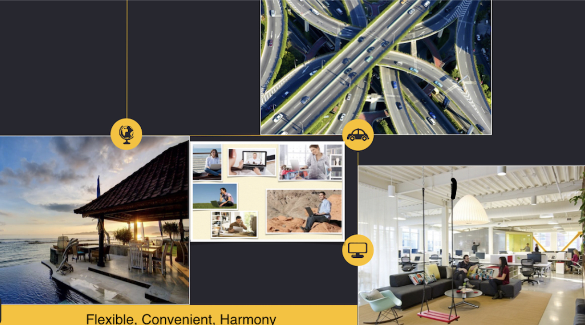

# WAY(Working As Yourself): Facilitating Flexible Working.

> Work is and ought to be sth you do in your way.

###  Index
- [RemoteWorkers](https://github.com/search?o=desc&q=remote+job&s=stars&type=Repositories) 
- [RemoteOnly](https://gitlab.com/gitlab-com/www-remoteonly-org/blob/master/source/index.html.md) | [Chinese](https://github.com/Integ/remoteonly) 
- [996.OUT.PATHWAY](https://github.com/Edening/996.OUT.Pathways) 

###  Being the Change
---
Season1 - Episode1 - [iFlex](https://github.com/Edening/iFlex)
* ChinaBridge: Enabling flexible working in mainland China【HRBP】
* Coach【Studio】
* Culture and Community【Media, Conference, …】

### Philosophy

* Work is not merely a means for but an intrinsic part of a good integral life.
* Workplace ought not to be a physical place.
* Working from anywhere in anytime is not only possible but also reasonable.
